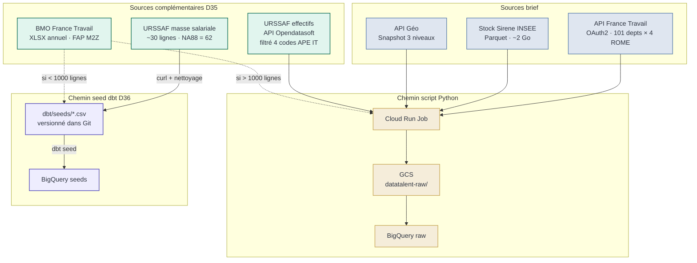
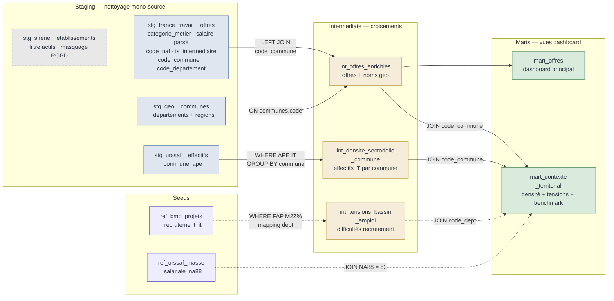
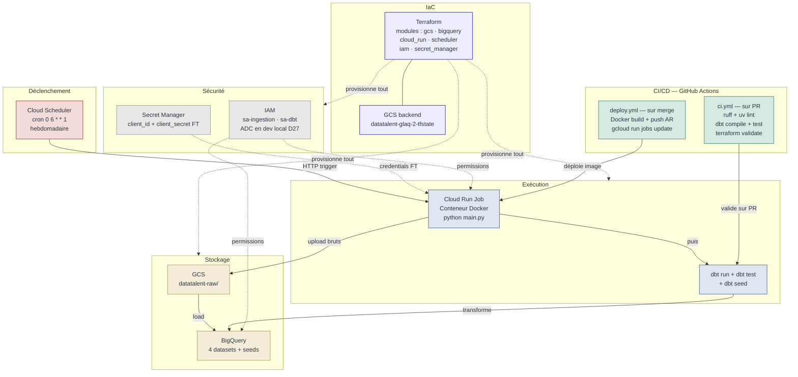

# Architecture DataTalent — Diagrammes détaillés

> **Complément à :** `architecture-datatalent.mermaid` (vue monolithique)
> **Dernière mise à jour :** 2026-03-25

Trois vues complémentaires. Chacune se lit indépendamment.

---

## 1. Acquisition des données — sources et chemins d'ingestion

Deux chemins distincts selon le volume et la nature de la source.

**Points clés :**
- Les 4 sources volumineuses ou nécessitant de la logique (OAuth2, pagination, téléchargement Parquet, API Opendatasoft) passent par Cloud Run → GCS → raw.
- Les 2 tables de référence à faible volume (< 1000 lignes) court-circuitent l'ingestion : CSV dans le repo Git, `dbt seed` les charge directement dans BigQuery.
- Le BMO a un chemin conditionnel (pointillés) : le spike déterminera lequel s'applique.

---

## 2. Transformations dbt — de staging aux marts

Le cœur analytique du pipeline. Chaque flèche est une jointure ou une transformation documentée.

**Points clés :**
- `stg_sirene__etablissements` est grisé en pointillés : il est maintenu comme livrable technique mais ne participe à aucune jointure (D14-bis).
- Les flèches pointillées (BMO, masse salariale) sont conditionnelles — dépendent du spike P2.
- `int_offres_enrichies` est la table pivot : chaque offre France Travail enrichie avec les noms géographiques via API Géo.
- `mart_contexte_territorial` agrège trois enrichissements contextuels : densité URSSAF, tensions BMO, benchmark salaire URSSAF.

---

## 3. Infrastructure et déploiement

Les composants transverses qui font tourner le pipeline.

**Points clés :**
- Cloud Scheduler déclenche le Cloud Run Job chaque lundi 6h. Le Job exécute séquentiellement l'ingestion Python puis dbt.
- Terraform provisionne l'intégralité de l'infra (sauf le bucket de state, seule ressource manuellement gérée — bootstrap problem).
- Deux workflows GitHub Actions : `ci.yml` valide sur PR (lint + dbt test + tf validate), `deploy.yml` déploie sur merge (Docker build + Cloud Run update).
- Secret Manager ne stocke que les credentials France Travail — les autres sources sont ouvertes (pas d'authentification).
