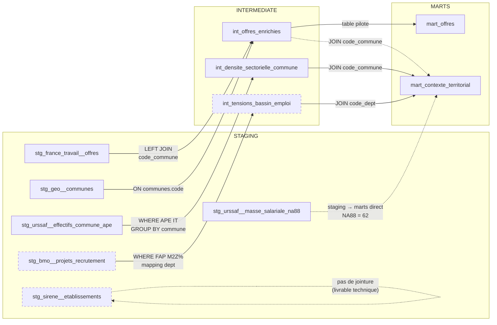

# Couche intermediate — Construction des tables

> **Projet :** DataTalent
> **Couche :** dbt intermediate (`intermediate/`)
> **Rôle :** croiser les tables staging entre elles. Chaque table staging est une vue nettoyée d'une seule source ; chaque table intermediate combine plusieurs sources pour produire une vue analytique.
> **Dernière mise à jour :** 2026-03-27 (D36 annulée — masse salariale passe par le chemin raw → staging classique)

---

## 1. `int_offres_enrichies` — l'offre complète

Table centrale du pipeline. Prend chaque offre France Travail et lui colle les informations géographiques qu'elle n'a pas nativement.

### Tables sources

| Table staging | Rôle dans la jointure |
|---|---|
| `stg_france_travail__offres` | Table pilote (LEFT = on garde toutes les offres) |
| `stg_geo__communes` | Apporte nom commune, nom département, nom région, population |

### Mécanique SQL

```sql
SELECT
    offres.*,
    communes.nom              AS nom_commune,
    communes.nom_departement,
    communes.nom_region,
    communes.population
FROM stg_france_travail__offres AS offres
LEFT JOIN stg_geo__communes AS communes
    ON offres.code_commune = communes.code
```

Le `LEFT JOIN` est critique : si une offre n'a pas de `code_commune` (7.3% des cas — les 188 offres avec uniquement un libellé département), elle reste dans le résultat avec des valeurs NULL sur les colonnes géo. Le `code_departement` (extrait en staging, couverture 100%) est déjà dans la table offres et permet un fallback pour ces cas.

### Ce qui n'est PAS dans cette jointure

Sirene. Le SIRET étant absent à 100% des offres, aucun `LEFT JOIN` sur Sirene n'aurait de sens — il retournerait NULL sur chaque ligne. L'enrichissement sectoriel vient directement des colonnes `code_naf` et `secteur_activite_libelle` déjà présentes dans staging (extraites du JSON France Travail).

### Colonnes en sortie

Toutes les colonnes staging de l'offre (id, intitulé, salaire parsé, catégorie métier, code NAF, is_intermediaire, code département, coordonnées…) + nom commune, nom département, nom région, population.

### Schéma de jointure

```
stg_france_travail__offres          stg_geo__communes
┌──────────────────────────┐        ┌──────────────────────┐
│ id                       │        │ code            (PK) │
│ intitule                 │        │ nom                  │
│ categorie_metier         │        │ nom_departement      │
│ salaire_annuel_min/max   │        │ nom_region           │
│ code_commune        ─────┼──LEFT──┼─► code               │
│ code_departement         │  JOIN  │ population           │
│ code_naf                 │        │ centre_lat/lon       │
│ is_intermediaire         │        └──────────────────────┘
│ latitude/longitude       │
│ ...                      │
└──────────────────────────┘
         │
         ▼
   int_offres_enrichies
   (toutes les colonnes offres + nom_commune, nom_dept, nom_region, population)
```

---

## 2. `int_densite_sectorielle_commune` — le tissu IT par commune

Ne touche pas les offres. Prépare un agrégat URSSAF filtré sur les codes APE du secteur IT, prêt à être joint aux offres dans la couche marts, ou affiché en couche indépendante dans le dashboard (carte de chaleur).

### Table source

| Table staging | Rôle |
|---|---|
| `stg_urssaf__effectifs_commune_ape` | Table unique — filtrée et agrégée |

### Mécanique SQL

```sql
SELECT
    code_commune,
    annee,
    SUM(nb_etablissements)  AS nb_etablissements_it,
    SUM(effectifs_salaries)  AS effectifs_salaries_it
FROM stg_urssaf__effectifs_commune_ape
WHERE code_ape IN ('62.01Z', '62.02A', '62.03Z', '62.09Z')
GROUP BY code_commune, annee
```

Le `WHERE` filtre sur les 4 codes APE du périmètre "secteur IT" :

| Code APE | Libellé |
|---|---|
| 62.01Z | Programmation informatique |
| 62.02A | Conseil en systèmes et logiciels informatiques |
| 62.03Z | Gestion d'installations informatiques |
| 62.09Z | Autres activités informatiques |

Le `GROUP BY` agrège ces 4 codes en une seule ligne par commune × année — on veut savoir "combien de salariés IT dans cette commune", pas le détail par sous-secteur.

### Pourquoi intermediate et pas staging

Le staging URSSAF contient *tous* les codes APE × *toutes* les communes. Le filtrage IT + agrégation est un croisement logique (choix des codes pertinents pour le projet), pas un nettoyage technique — donc intermediate.

### Colonnes en sortie

`code_commune`, `annee`, `nb_etablissements_it`, `effectifs_salaries_it`.

### Schéma de transformation

```
stg_urssaf__effectifs_commune_ape
┌──────────────────────────────┐
│ code_commune                 │
│ code_ape                     │──► WHERE code_ape IN (62.01Z, 62.02A, 62.03Z, 62.09Z)
│ annee                        │
│ nb_etablissements            │──► SUM() ──┐
│ effectifs_salaries           │──► SUM() ──┤
└──────────────────────────────┘            │
                                            ▼
                              int_densite_sectorielle_commune
                              ┌────────────────────────────┐
                              │ code_commune          (GBY)│
                              │ annee                 (GBY)│
                              │ nb_etablissements_it       │
                              │ effectifs_salaries_it      │
                              └────────────────────────────┘
```

### Utilisation en aval

Dans la couche marts, cette table est jointe à `int_offres_enrichies` sur `code_commune` pour ajouter à chaque offre le contexte "cette commune compte X établissements IT et Y salariés IT". Ça permet de calculer des ratios comme `offres / effectifs` = indicateur de dynamisme de recrutement.

---

## 3. `int_tensions_bassin_emploi` — les difficultés de recrutement IT

**Conditionnelle** — ne sera construite que si le spike sur le BMO confirme que les codes FAP2021 distinguent suffisamment les profils IT.

### Table source

| Table staging | Rôle |
|---|---|
| `stg_bmo__projets_recrutement` | Table unique — filtrée et restructurée |

### Mécanique SQL (provisoire, dépend du schéma réel du XLSX)

```sql
SELECT
    code_bassin_emploi,
    code_departement,    -- dérivé du bassin pour permettre la jointure
    annee,
    projets_recrutement,
    part_difficile_pct
FROM stg_bmo__projets_recrutement
WHERE code_fap LIKE 'M2Z%'    -- famille "Informatique et télécommunications"
```

### Problème de géographie

Le BMO utilise une géographie propre (bassins d'emploi, ~400 zones) qui ne correspond ni aux communes ni aux départements. La jointure avec les offres se fera au niveau département — un mapping bassin → département est nécessaire. Deux options :

- Département majoritaire du bassin (simplifie mais perd en précision pour les bassins frontaliers)
- Duplication sur chaque département couvert (préserve l'info mais multiplie les lignes)

Le choix sera tranché au spike.

### Colonnes en sortie

`code_departement`, `annee`, `projets_recrutement_it`, `part_difficile_pct`.

### Schéma de transformation

```
stg_bmo__projets_recrutement
┌──────────────────────────────┐
│ code_bassin_emploi           │
│ code_fap                     │──► WHERE code_fap LIKE 'M2Z%'
│ annee                        │
│ projets_recrutement          │
│ part_difficile_pct           │
└──────────────────────────────┘
               │
               ▼ mapping bassin → département
 int_tensions_bassin_emploi
 ┌────────────────────────────┐
 │ code_departement           │
 │ annee                      │
 │ projets_recrutement_it     │
 │ part_difficile_pct         │
 └────────────────────────────┘
```

### Utilisation en aval

Dans les marts, jointure sur `code_departement` pour ajouter aux offres un indicateur "dans ce département, X% des projets de recrutement IT sont jugés difficiles par les employeurs".

---

## 4. Ce qui ne passe PAS par intermediate

Deux tables staging ne participent pas à la couche intermediate. Elles sont référencées directement en marts ou maintenues comme livrables techniques.

| Table staging | Raison du skip | Chemin aval |
|---|---|---|
| `stg_sirene__etablissements` | Aucune jointure possible (SIRET absent à 100%, D14-bis) | Livrable technique seul — démonstration dbt sur source volumineuse |
| `stg_urssaf__masse_salariale_na88` | Table de référence mono-source (~30 lignes), pas de croisement inter-sources nécessaire | Jointure directe en marts (`mart_contexte_territorial`) sur code NA88 = `62` pour le benchmark salaire brut moyen sectoriel |

**Justification du skip pour la masse salariale :** la couche intermediate est dédiée aux croisements multi-sources. `stg_urssaf__masse_salariale_na88` est une table de référence à source unique qui ne nécessite ni filtrage logique (elle arrive déjà filtrée NA88 = 62 depuis l'ingestion), ni agrégation, ni mapping géographique. Une table intermediate serait un pass-through sans valeur ajoutée — la jointure directe en marts est le bon pattern.

---

## 5. Vue d'ensemble des flux — ASCII

```
STAGING                          INTERMEDIATE                    MARTS
───────                          ────────────                    ─────

stg_france_travail__offres ──┐
                             ├──► int_offres_enrichies ────────► mart_offres
stg_geo__communes ───────────┘         │
                                       │  LEFT JOIN sur code_commune
                                       ▼
stg_urssaf__effectifs ──────► int_densite_sectorielle ────────► mart_contexte_territorial
                              (filtré codes APE IT)      │           │
                                                         │           │
stg_bmo__projets ───────────► int_tensions_bassin ───────┘           │
                              (filtré codes FAP IT)                  │
                                                                     │
stg_urssaf__masse_salariale ─────────────────────────────────────────┘
                              (ref directe en marts, pas d'intermediate)

stg_sirene__etablissements ──► (pas de jointure — livrable technique seul)
```

## 6. Vue d'ensemble des flux — Mermaid



**Légende :** les traits pleins sont des jointures confirmées. Les traits pointillés sont soit des jointures directes staging → marts (sans passer par intermediate), soit des éléments conditionnels (BMO → `int_tensions` dépend du spike). Sirene est isolé — livrable technique sans contribution analytique.
